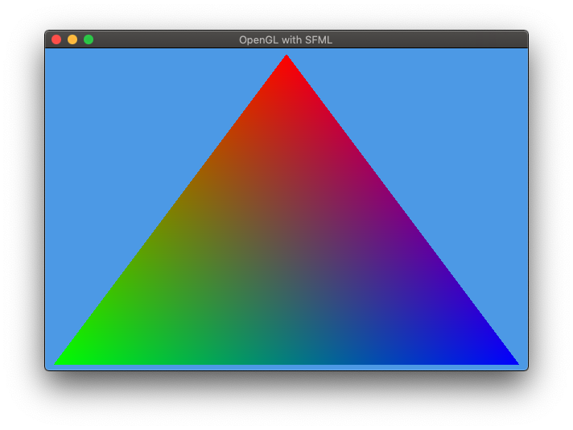
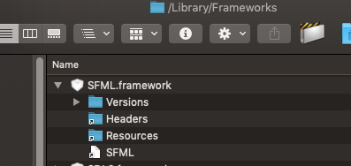

# C++ SFML OpenGL Boilerplate

## Description

Simple OepnGL application with SFML window rendering.

The application screenshot on macOS Mojave 10.14.6:

## Preparing

1. Download SFML libraries from [sfml-dev.org](https://www.sfml-dev.org/download.php)

2. In macOS place it to /Library/Frameworks like this:

    

3. Open project in CLion

4. Press ^R for Run or ^D for Debug